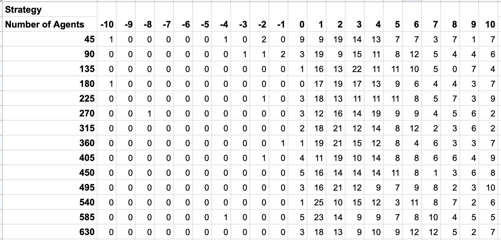
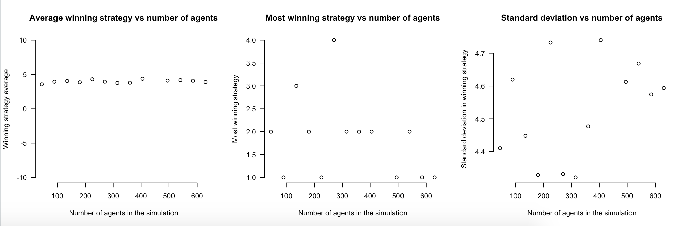
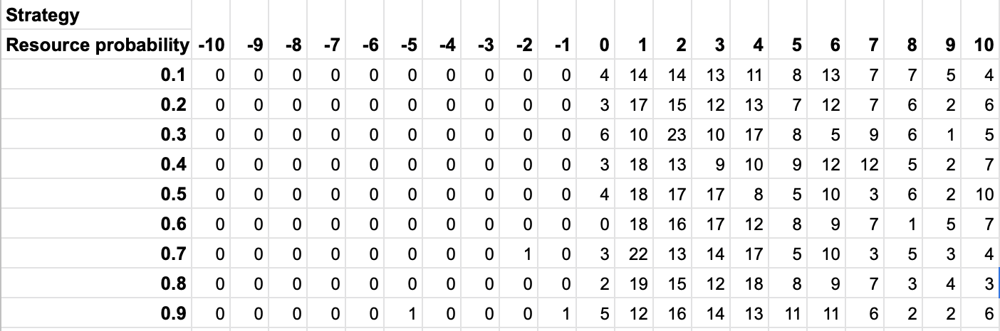
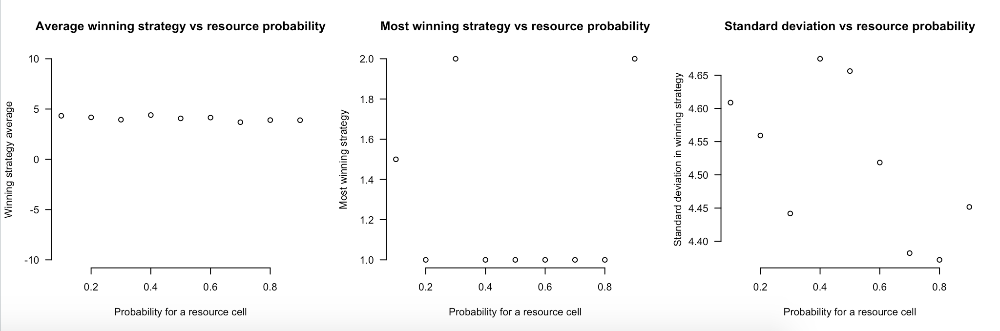
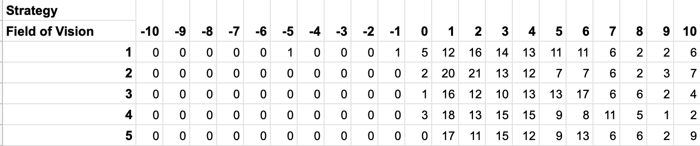
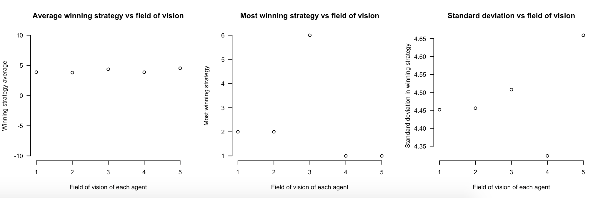
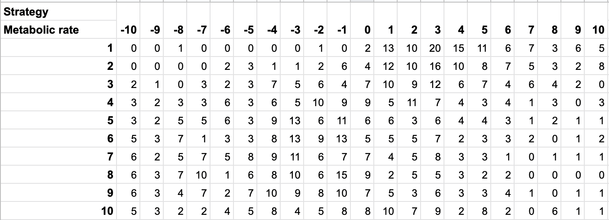
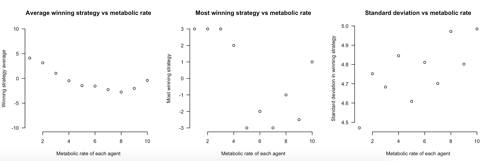

# Simulation Final Group Project

*Ryan Jennings - Arda Basaran - Aaron Gano*

## Description

Our project aims to model a battle royale scenario using a cellular automaton. Agents in the simulation are placed in a 2D grid, their knowledge of the grid is limited by their field of vision and they can move in any of 8 neighboring cells. Each agent has some amount of resource, which depletes as time passes according to their metabolic rate.  They can replenish their resources by consuming resources placed in the grid or engaging in a fight with another agents and taking their resources (if they win).

The central question we try to answer with this simulation is:

>  What survival strategy is the most optimal for agents in a battle royale scenario?

In the context of our simulation, the definitions of some of the terms from this question are:

* survival strategy: level of aggression/weighted tendency of an agent to pursue movement in a certain direction
* “most optimal”: success is determined by the survival of agents or groups of agents performing some survival strategy
* battle royale: agents or groups of agents compete to be the last standing 

## Design Decisions

The simulation and experimentation consists of 4 components: Universe, Agent, Resource, Statistics. 

### Universe

Universe class represents the whole simulation. It stores all the agents and resources being simulated and it implements the update method, which is how the simulation moves from one state to another.

Simulation runs in 2D square grid, named environment. Environment is represented by 2 dimensional list with env_size rows and columns, where each entry in the list is either an instance of Agent or Resource, or is an EMPTY_CELL (which is 0).

Since Agent is only partially informed about the Universe (with respect to their field of vision), they do not have information of their location in the whole 2D grid. Thus, a dictionary is used to store locations of all agents in the universe. When update is called on an Agent, a restricted environment is passed, which is includes only the cells from environment that is in the field of vision of the Agent. 

The pseudocode for the method is as follows:

```
update():
	update_resources()
	shuffle(agents)
	for each agent:
		agent.update_resources()
		move = agent.find_best_move()
		resolve_movement(move)
```

Agents are shuffled before updating to make sure ordering of the list of agents does not favor any agent. Once an Agent finds the move that it wants to make, it is resolved by the Universe. If the cell is empty the Agent is moved, if there is a resource on the cell it is consumed by the agent, and if there is another agent in the cell, two agents "fight" (the one with the more resources wins) and one survives.

### Agent

Each agent has a field of vision, metabolic rate, some number of resources and a value indicating their strategy. 

Field of vision indicates the radius of the area they can see when they make a decision on where to move. Unless noted otherwise, every agent has a field of radius of 1. 

Metabolic rate is the number of units of resources consumed per update. Metabolic rate of an agent is 1 unless noted otherwise.

Strategy is an indication of how another agent is percieved by an agent. It is an integer value between -10 and 10, where the value is used for scoring when deciding on what move to perform, as explained below. The strategy for each agent is calculated as follows: a random value is drawn from a normal distribution with mean 0 and standard deviation of 5, then this value is rounded to nearest integer, except any value <-10 is set to -10 and any value >10 is set to 10.

When an agent is asked to make a move, it looks at its restricted environment and creates a list of scores. This is constructed so that every cell in the restricted environment is assigned a number. To get the score for a cell, we loop over all the agents and resources in the restricted environment. For each resource we add `resource value - distance to resource` to cell's score. For each agent we add `strategy value - distance to agent` if strategy value is positive, `strategy value + distance to agent` if strategy value is negative, and if strategy value is zero, than it has no affect on the score of the cell at all. Once the scores are calculated, the agent selects the move with the maximum score (or randomly selects one if there are multiple).

### Resource

Once the agents are placed in the universe, all the remaining cells in the environment has resource_prob chance to be a resource cell. Resource cells indicate a resource with 10 units, agents can move to the cell that has the resource and consume it, adding 10 units to the amount of resources the agent has. 

### Statistics

Statistics class implements the functions that collects all the data that is needed over multiple runs of simulation. Specific statistics collected are explained on a seperate section.

## Testing

To make sure our model is doing the "right thing" we ran the following tests:

* test_find_best_move(): Asserts that _find_best_move() method works as expected.
* test_single_agent(): Initializes a universe with single agent assert the simulation does not run.
* test_two_agents(): Initializes a universe with two agents without any resources and asserts the simulation does not update more than 10 times.
* test_simulation_run(): A complete run of simulation with 2 agents and resource probability 0.4. We can debug output is printed so we can see what moves agents make at each step. 

## Collected Statistics

The simulation allows various values to be changed. To avoid trying to explore the full variable space, we decided to change variables one at a time, while keeping all the others at their default values. Thus, we collected the number of times a strategy has won over 100 simulation runs.

* Number of agents: With respect to environment size, from 5% to 70%

  

  

* Resource abundance: Controlled by resource_prob variable from 0.1 to 0.9

  

  

* Field of vision: Varying from 1 to 5

  

  

* Metabolic rate: Varying from 1 to 10

  



## Conclusions

Since we do our analysis varying one variable at a time, the default values we used are important for our conclusions:

```
value for each resource: 10
agent strategy distribution: normal(0, 5)
agent placement in the grid: random, uniform
num_agents: 100
env_size: 30
resource_prob: 0.4
metabolic_rate: 1
field_of_vision: 1
```

With these default values, looking at the tables and graphs above we can conclude:

* In most cases expected strategy value of the winning agent is around 4.
* The most winning strategy value is usually 1 or 2.
* The standard deviation of the winning strategy value is usually between 4-5
* Changing the number of agents, resource abundance and field of vision of agents do not have any significant effect on average winning strategy value or most winning strategy value or the standard deviation of the winning strategy value.
* As metabolic rate of agents increase, average winning strategy value drops from around 4 to around 0. We also see most winning value to go down to negative strategy values. Standard devaition of the winning strategy value stays between 4-5.

## How to run

Python 3 and package randomgen is required to run the simulation.

* To run the tests:

  ```
  python tests.py
  ```

* To run the script that collects the statistics (takes around 10 minutes to run):

  ```
  python collect_stats.py
  ```

* To run a demo version of the simulation with each state printed out to terminal:

  ```
  python main.py
  ```

* The graphs above can be reproduced by running the R script named `analysis.R`

* Any instance of the simulation (with Universe parameters initialized) can be run in Python as follows:

  ```python
  universe = Universe(num_agents, env_size, resource_prob, 
  										metabolic_rate=1, field_of_vision, seed, debug)
  stats = Statistics()
  while not universe.is_finished():
      universe.update(stats)
  ```